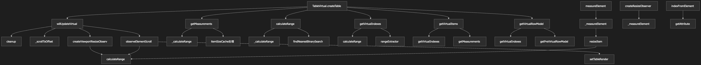

我来分析 `TableVirtual.ts` 文件中的函数依赖关系和调用顺序，并用流程图的方式展示。

## 函数依赖关系和调用顺序分析

### 主要函数分类

1. **初始化函数**
2. **计算函数**
3. **测量函数**
4. **滚动处理函数**
5. **工具函数**

### 函数调用流程图

```mermaid
graph TD
    A[TableVirtual.createTable] --> B[willUpdateVirtual]
    A --> C[getMeasurements]
    A --> D[calculateRange]
    A --> E[getVirtualIndexes]
    A --> F[getVirtualItems]
    A --> G[getVirtualRowModel]
    
    B --> B1[cleanup]
    B --> B2[_scrollToOffset]
    B --> B3[createViewportResizeObserver]
    B --> B4[observeElementScroll]
    
    C --> C1[_calculateRange]
    C --> C2[itemSizeCache处理]
    
    D --> D1[_calculateRange]
    D --> D2[findNearestBinarySearch]
    
    E --> E1[calculateRange]
    E --> E2[rangeExtractor]
    
    F --> F1[getVirtualIndexes]
    F --> F2[getMeasurements]
    
    G --> G1[getVirtualIndexes]
    G --> G2[getPreVirtualRowModel]
    
    B3 --> H[calculateRange]
    B4 --> I[setTableRender]
    B4 --> H
    
    J[_measureElement] --> K[resizeItem]
    K --> H
    
    L[measureElement] --> J
    
    M[createResizeObserver] --> N[_measureElement]
    O[indexFromElement] --> P[getAttribute]
```






### 详细依赖关系

#### 1. 初始化流程
- `TableVirtual.createTable` 是入口函数
- 初始化各种缓存和观察者
- 设置表格实例方法

#### 2. 虚拟滚动核心流程
```
willUpdateVirtual() 
  → cleanup() [清理之前的监听]
  → _scrollToOffset() [设置初始滚动位置]
  → createViewportResizeObserver() [监听容器大小变化]
  → observeElementScroll() [监听滚动事件]
```

#### 3. 测量和计算流程
```
getMeasurements()
  → 处理 itemSizeCache
  → 计算每个项目的偏移量
  → 返回 measurementsCache

calculateRange()
  → 依赖 getMeasurements()
  → 依赖 getViewportHeight()
  → 调用 _calculateRange()
  → 更新虚拟状态

_calculateRange()
  → 调用 findNearestBinarySearch()
  → 计算 startIndex 和 endIndex
```

#### 4. 虚拟行处理流程
```
getVirtualIndexes()
  → 依赖 calculateRange()
  → 调用 rangeExtractor()
  → 返回可见行索引数组

getVirtualItems()
  → 依赖 getVirtualIndexes()
  → 依赖 getMeasurements()
  → 返回虚拟项目数组

getVirtualRowModel()
  → 依赖 getVirtualIndexes()
  → 依赖 getPreVirtualRowModel()
  → 返回过滤后的行模型
```

#### 5. 元素测量流程
```
_measureElement()
  → 获取元素索引
  → 更新 elementsCache
  → 调用 resizeItem()

resizeItem()
  → 更新 itemSizeCache
  → 调用 calculateRange() [重新计算范围]

measureElement() [公共API]
  → 调用 _measureElement()
```

#### 6. 工具函数依赖
- `findNearestBinarySearch`: 二分查找算法，被 `_calculateRange` 调用
- `indexFromElement`: 从DOM元素获取索引，被 `_measureElement` 调用
- `createResizeObserver`: 创建ResizeObserver，内部调用 `_measureElement`

### 关键调用链

1. **滚动触发**: `observeElementScroll` → `setTableRender` → `calculateRange`
2. **大小变化**: `_measureElement` → `resizeItem` → `calculateRange`
3. **容器变化**: `createViewportResizeObserver` → `calculateRange`
4. **数据获取**: `getVirtualRowModel` → `getVirtualIndexes` → `calculateRange` → `getMeasurements`

### 缓存依赖关系

- `measurementsCache`: 存储所有行的测量数据
- `itemSizeCache`: 存储项目大小缓存
- `elementsCache`: 存储DOM元素引用
- `pendingMeasuredCacheIndexes`: 待处理的测量索引

这个流程图展示了虚拟滚动系统的完整工作流程，从初始化到实际的滚动计算，以及各个函数之间的依赖关系。

我已经分析了 `packages/table-core/src/features/TableVirtual.ts` 文件中的函数依赖关系和调用顺序。

## 主要函数调用流程图

### 1. 初始化流程
```
TableVirtual.createTable
  → willUpdateVirtual()
    → cleanup()
    → _scrollToOffset()
    → createViewportResizeObserver()
    → observeElementScroll()
```

### 2. 虚拟滚动核心计算流程
```
getMeasurements() → calculateRange() → getVirtualIndexes() → getVirtualItems() → getVirtualRowModel()
```

### 3. 元素测量和大小变化处理
```
_measureElement() → resizeItem() → calculateRange()
```

### 4. 滚动事件处理
```
observeElementScroll() → setTableRender() → calculateRange()
```

### 5. 关键函数依赖关系
- **getMeasurements()**: 计算所有行的测量数据，依赖 itemSizeCache
- **calculateRange()**: 计算可见范围，依赖 getMeasurements() 和 getViewportHeight()
- **getVirtualIndexes()**: 获取可见行索引，依赖 calculateRange()
- **getVirtualItems()**: 获取虚拟项目，依赖 getVirtualIndexes() 和 getMeasurements()
- **getVirtualRowModel()**: 获取虚拟行模型，依赖 getVirtualIndexes() 和 getPreVirtualRowModel()

### 6. 工具函数
- **_calculateRange()**: 内部范围计算，调用 findNearestBinarySearch()
- **_measureElement()**: 元素测量处理，调用 resizeItem()
- **findNearestBinarySearch()**: 二分查找算法
- **indexFromElement()**: 从DOM元素获取索引

整个虚拟滚动系统通过 memo 函数进行性能优化，确保只有在依赖项变化时才重新计算。