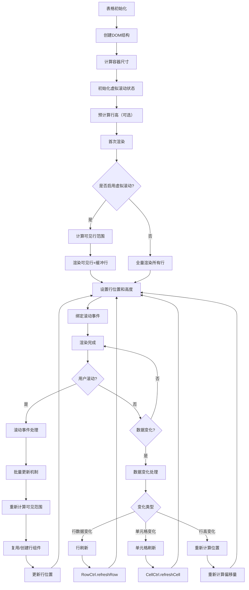
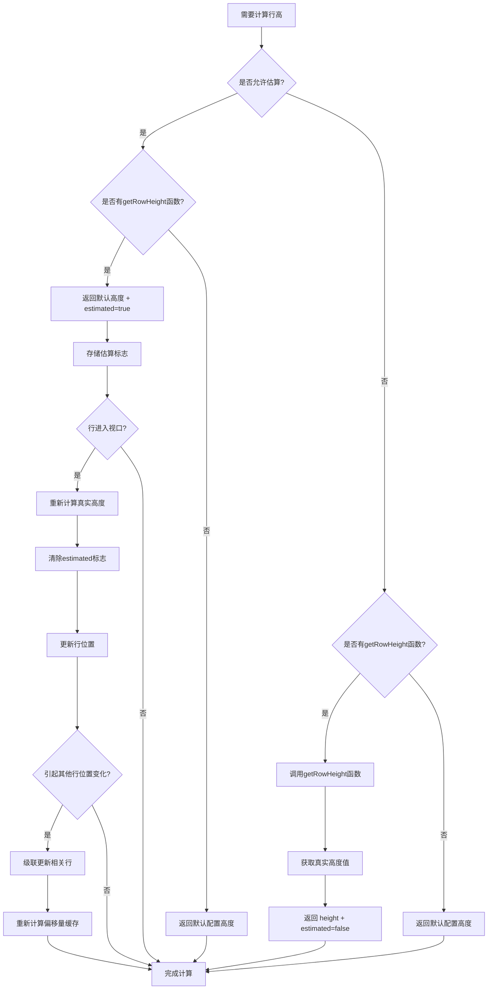
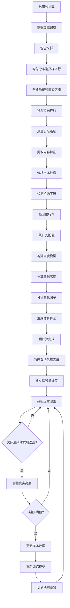
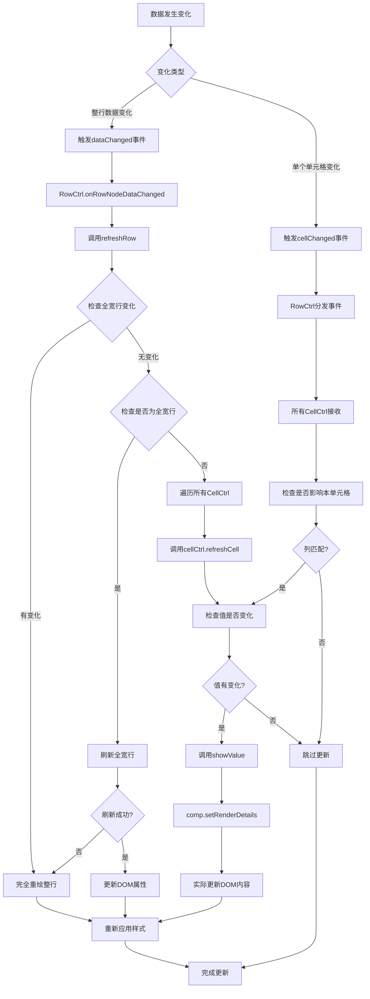
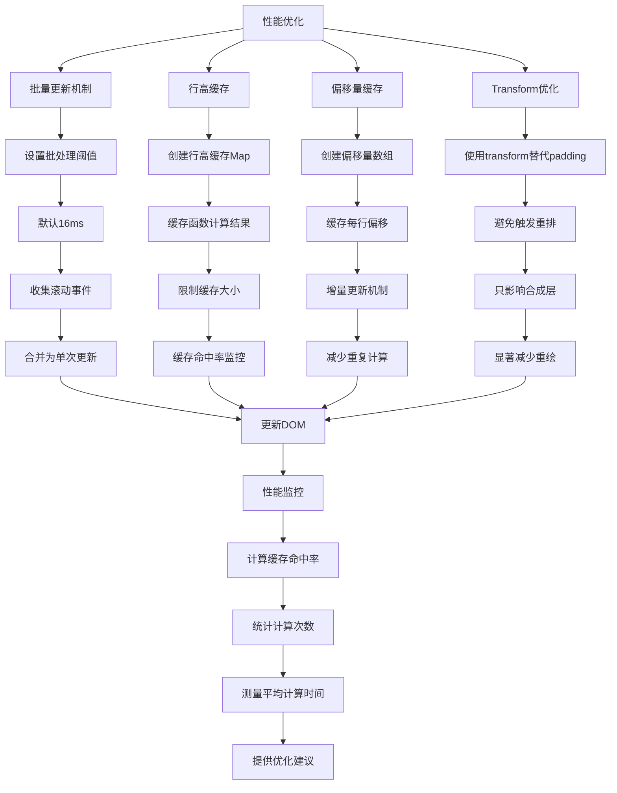

# 表格渲染流程图

## 1. 总体架构流程



## 2. 虚拟滚动详细流程

```mermaid
graph TD
    A[滚动事件触发] --> B[节流/防抖处理]
    B --> C[获取滚动位置 scrollTop]
    C --> D[计算起始行索引]
    
    D --> E[startIndex = floor(scrollTop / rowHeight) - overscan]
    E --> F[计算可见行数]
    F --> G[visibleCount = ceil(viewportHeight / rowHeight)]
    G --> H[计算结束索引]
    
    H --> I[endIndex = min(startIndex + visibleCount + 2*overscan, totalRows-1)]
    I --> J[获取当前渲染的行]
    J --> K{行是否已渲染?}
    
    K -->|是| L[复用现有行组件]
    K -->|否| M[创建新行组件]
    
    L --> N[更新行位置和样式]
    M --> O[创建RowCtrl]
    O --> P[创建RowComp]
    P --> Q[创建CellCtrl]
    Q --> R[创建CellComp]
    R --> N
    
    N --> S[应用transform偏移]
    S --> T[更新容器总高度]
    T --> U[渲染完成]
    
    U --> V{是否需要预计算校正?}
    V -->|是| W[测量实际行高]
    W --> X{估算误差>20%?}
    X -->|是| Y[更新高度模型]
    Y --> Z[重新计算所有位置]
    Z --> T
    X -->|否| U
    V -->|否| U
```

## 3. 行高度计算流程



## 4. 预计算机制流程



## 5. 数据变化时的DOM更新流程



## 6. 性能优化机制



## 7. 关键概念说明

### 7.1 三层渲染架构
- **RowRenderer**: 管理所有行的渲染逻辑，计算视口范围
- **RowCtrl**: 控制单个行的行为和状态
- **RowComp**: 负责实际的DOM渲染

### 7.2 虚拟滚动核心机制
- **可见范围计算**: 基于scrollTop和viewportHeight计算需要渲染的行范围
- **缓冲机制**: 在可见区域外额外渲染一些行，保证滚动平滑
- **组件复用**: 通过回收机制重用行组件，减少创建开销

### 7.3 行高计算策略
- **估算机制**: 初始时使用默认高度，标记为estimated
- **实际测量**: 行进入视口时重新计算真实高度
- **动态校正**: 根据实际渲染结果持续优化高度模型

### 7.4 性能优化技术
- **批量更新**: 合并多个滚动事件，减少重绘次数
- **缓存机制**: 缓存行高和偏移量计算结果
- **Transform优化**: 使用CSS transform避免触发重排

这个渲染流程图展示了表格从初始化到实际渲染的完整过程，包括虚拟滚动、行高计算、数据更新等核心机制，帮助理解整个系统的工作原理。