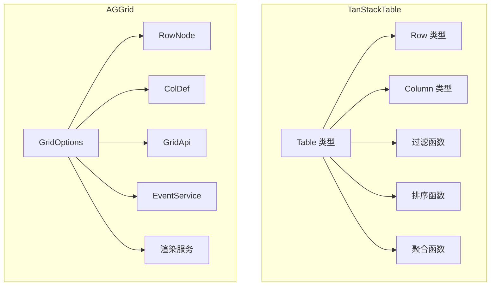

# TanStack Table 与 AG Grid 核心代码对比分析

## 1. 概述

TanStack Table（`packages/table-core`）与 AG Grid（`packages/ag-grid-community`）均为主流表格库，分别代表极简函数式与企业级服务驱动两种设计理念。本文从核心类型、功能模块、实现方式、设计理念、扩展性等方面进行详细对比。

---

## 2. 核心类型与功能模块

| 维度     | TanStack Table                                                | AG Grid                                                                        |
| -------- | ------------------------------------------------------------- | ------------------------------------------------------------------------------ |
| 表格类型 | [`Table`](packages/table-core/src/types.ts:137)               | [`GridOptions`](packages/ag-grid-community/src/entities/gridOptions.ts)        |
| 行类型   | [`Row`](packages/table-core/src/types.ts:211)                 | [`RowNode`](packages/ag-grid-community/src/entities/rowNode.ts)                |
| 列类型   | [`Column`](packages/table-core/src/types.ts:340)              | [`ColDef`](packages/ag-grid-community/src/entities/colDef.ts)                  |
| 行模型   | [`RowModel`](packages/table-core/src/types.ts:221)            | [`RowNode`](packages/ag-grid-community/src/entities/rowNode.ts)                |
| 配置选项 | [`TableOptions`](packages/table-core/src/types.ts:173)        | [`GridOptions`](packages/ag-grid-community/src/entities/gridOptions.ts)        |
| 过滤函数 | [`filterFns`](packages/table-core/src/filterFns.ts)           | [`FilterChangedEvent`](packages/ag-grid-community/src/events.ts:357)           |
| 排序函数 | [`sortingFns`](packages/table-core/src/sortingFns.ts)         | [`SortChangedEvent`](packages/ag-grid-community/src/events.ts:416)             |
| 聚合函数 | [`aggregationFns`](packages/table-core/src/aggregationFns.ts) | [`GroupSelectionMode`](packages/ag-grid-community/src/gridOptionsUtils.ts:504) |
| 渲染服务 | 用户自定义渲染                                                | [`rowRenderer`](packages/ag-grid-community/src/rendering/rowRenderer.ts)       |
| 状态管理 | 类型驱动，函数式                                              | 类与服务驱动，事件系统丰富                                                     |

---

## 3. 实现方式对比

- **表格结构与数据模型**
  - TanStack Table：类型和函数驱动，数据流和状态高度可定制。
  - AG Grid：面向对象，类与接口定义结构，内置丰富状态和事件。

- **渲染机制**
  - TanStack Table：核心库不直接渲染 DOM，渲染交由外部框架。
  - AG Grid：自带渲染引擎，支持虚拟滚动和高性能渲染。

- **过滤、分组、排序、分页**
  - TanStack Table：函数式扩展点，插件化能力强，用户可自定义。
  - AG Grid：内置多种功能，事件和服务高度模块化，支持复杂场景。

- **扩展性与定制性**
  - TanStack Table：高度解耦，所有 UI/行为均可自定义，适合个性化需求。
  - AG Grid：配置项和扩展点丰富，支持自定义渲染器、编辑器、服务等。

---

## 4. 设计理念与扩展性

- **TanStack Table**
  - 极简、函数式、类型驱动，核心只关注数据和状态，插件化和自定义能力极强。
- **AG Grid**
  - 面向对象、服务驱动，强调高性能和企业级功能，内置渲染和交互，适合大规模应用。

---

## 5. Mermaid 架构关系图

---

## 6. 总结

TanStack Table 适合需要高度自定义和插件化的场景，AG Grid 适合企业级、快速集成和复杂交互需求。两者在架构、扩展性和功能覆盖上各有优势，选型需结合实际业务需求。
